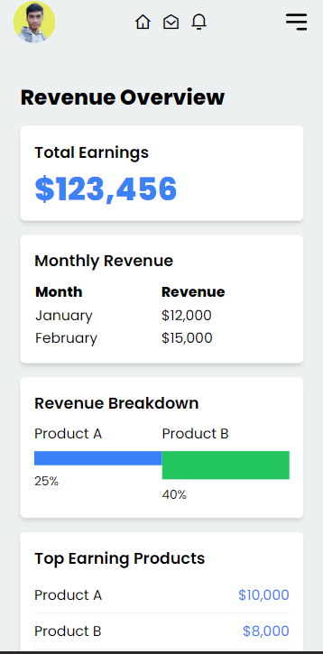

# Professional Dashboard Project

This project is a responsive and professional-looking dashboard that showcases various sections, charts, and additional information.

## Table of Contents

- [Overview](#overview)
- [Features](#features)
- [Screenshots](#screenshots)
- [Usage](#usage)
- [Installation](#installation)
- [Contributing](#contributing)
- [License](#license)

## Overview

The dashboard project provides a visually appealing and responsive interface for presenting data and information in different sections. It includes various cards with data, charts, and additional content. The project uses Tailwind CSS for styling and Chart.js library for implementing interactive charts.

## Features

- Responsive design for mobile, tablet, and desktop screens.
- Different sections for displaying data, charts, and additional information.
- Implementation of charts using the Chart.js library.
- Styling and layout crafted with Tailwind CSS.

Your syntax for including screenshots looks correct, but there's a minor issue with the first screenshot's filename. If there are spaces in the filename, you should replace them with URL-encoded characters or underscores. Here's an updated version:

## Screenshots



## Usage

1. Clone the repository:

   ```bash
   git clone https://github.com/NUR-9922/dashboard.git


1 Open the index.html file in your web browser.
2 Explore the different sections and charts within the dashboard.

## Installation
No specific installation steps are required. Simply clone the repository and open the HTML file in your browser.

## Contributing

If you would like to contribute to this project, please follow these steps:

1. Fork the repository.
2. Create a new branch for your feature or bug fix.
3. Make your changes and commit them.
4. Push the changes to your fork.
5. Create a pull request.
